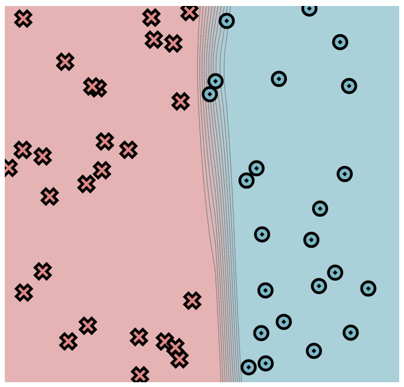
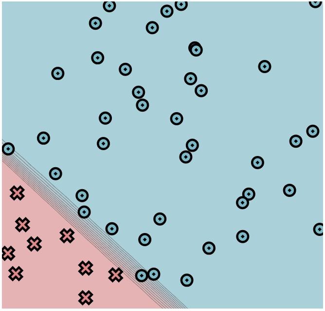
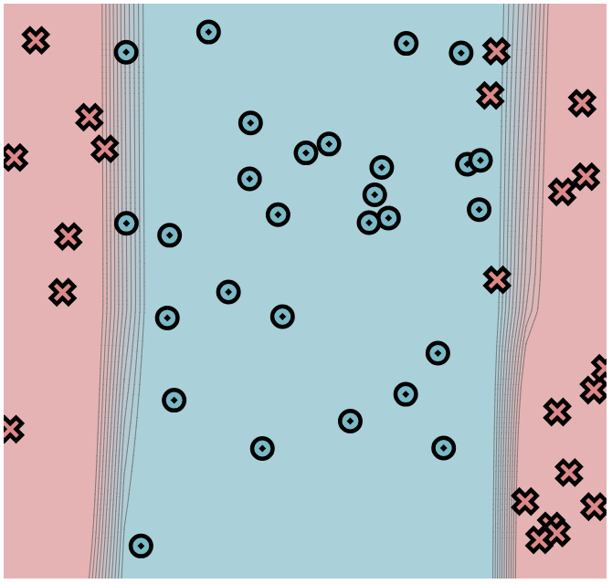
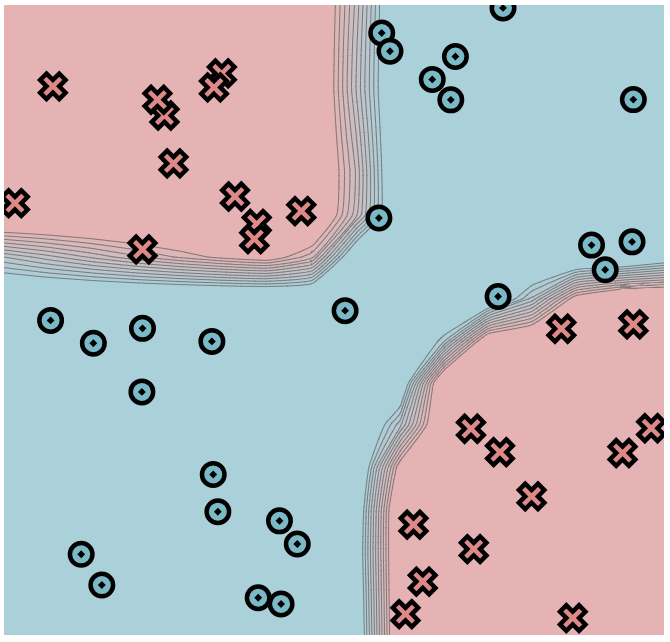

[](https://classroom.github.com/a/YFgwt0yY)
# MiniTorch Module 2


* Docs: https://minitorch.github.io/

* Overview: https://minitorch.github.io/module2/module2/

This assignment requires the following files from the previous assignments. You can get these by running

```bash
python sync_previous_module.py previous-module-dir current-module-dir
```

The files that will be synced are:

        minitorch/operators.py minitorch/module.py minitorch/autodiff.py minitorch/scalar.py minitorch/scalar_functions.py minitorch/module.py project/run_manual.py project/run_scalar.py project/datasets.py



Dataset: Simple (hidden layers: 3, learning rate = 0.1, time per epoch = 0.152s, number of epochs = 1200, number of points = 50)



Dataset: Diagonal (hidden layers: 4, learning rate = 0.1, time per epoch = 0.203s, number of epochs = 1200, number of points = 50)



Dataset: Split (hidden layers: 10, learning rate = 1.0, time per epoch = 0.703s, number of epochs = 1200, number of points = 50)



Dataset: Xor (hidden layers: 16, learning rate = 0.5, time per epoch = 1.524s, number of epochs = 1600, number of points = 50)